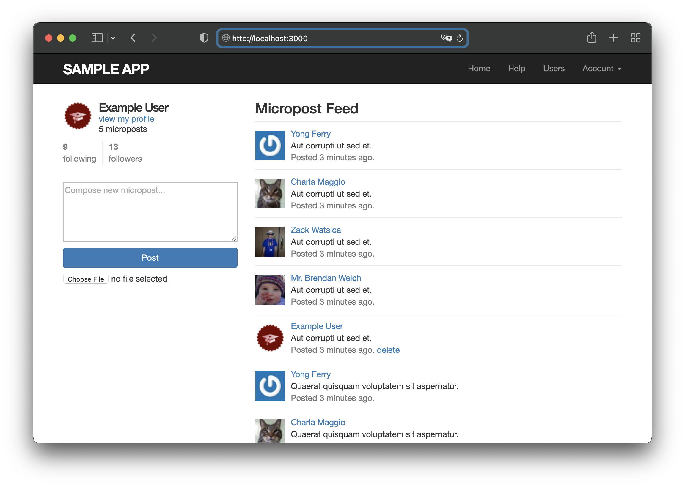

# sample-app-rails

A sample app for [SetOps](https://setops.co) built with [Node.js](https://rails.dev).

The app is based on https://github.com/learnenough/sample_app_6th_ed and distributed under [MIT License](LICENSE.md).

The app is [deployed on SetOps](https://web.rails.samples.zweitagapps.net) with GitHub Actions from this repository: [check out the deployment workflow](.github/workflows/deploy.yml)!

If you want to deploy the app yourself, use the image referenced below. Apps created from a SetOps stage template use this image, too.

```
docker pull ghcr.io/setopsco/sample-app-rails:latest
```



## What to try

1. Deploy the app as a sample app from the SetOps Web UI. You can select it from the list of sample apps when you create a stage.

1. Wait until the stage is created and the progress bar disappears. Click on the stage and select the *web* app.

1. Make yourself comfortable with the app status dashboard and the information it tells you about the current state of your app.

1. Open the web app with a click on `Visit Website`.

1. Register a new user or login with existing default user `example@railstutorial.org` with password `foobar`.

1. Read and create posts.


## Components

* **App:** There is one SetOps app: *web*.

  The web app contains the actual rails application build from the code in this repository.

* **Services:**

  - **PostgresQL** is used to store all records of users and posts.
  - **S3 Bucket** stores uploaded pictures. 

## Creating the app

> **Note**
> These are the steps you need to follow to manually create the app in SetOps. You can use a stage template on the web UI to do this in one step.

1. Create the stage: `setops -p samples stage:create rails`

1. Create the app: `setops -p samples -s rails app:create web`

1. Configure the app:

   ```
   setops -p samples -s rails --app web container:set command -- /bin/bash -c "DISABLE_DATABASE_ENVIRONMENT_CHECK=1 bundle exec rake db:schema:load db:seed && bundle exec puma"
   setops -p samples -s rails --app web container:set health-check -- /bin/sh -c 'curl -s http://localhost:$PORT/.well-known/health-check | grep ok'
   setops -p samples -s rails --app web network:set health-check-path /.well-known/health-check
   setops -p samples -s rails --app web network:set public true
   setops -p samples -s rails --app web network:set port 3000
   setops -p samples -s rails --app web resource:set cpu 128
   setops -p samples -s rails --app web resource:set memory 384
   ```

1. Set ENVs:

   ```
   setops -p samples -s rails --app web env:set SECRET_KEY_BASE=YOUR-SECRET-KEY --description "Secret Key to encrypt and sign sessions"
   setops -p samples -s rails --app web env:set LOGIN_EMAIL=example@railstutorial.org --description "Email for the default admin user"
   setops -p samples -s rails --app web env:set LOGIN_PASSWORD=foobar --description "Password for the default admin user"
   ```

1. Create the Postgres database: `setops -p samples -s rails service:create database --type postgresql11 --plan shared`

1. Create the S3 bucket: `setops -p samples -s rails service:create store --type s3`

1. Create service links:

   ```
   setops -p samples -s rails --app web link:create database --env-key DATABASE_URL
   setops -p samples -s rails --app web link:create store --env-key S3_DATA_URL
   ```

1. Commit your changes: `setops -p samples -s rails changeset:commit`

1. Push the Docker image and activate the release:

   ```
   docker pull ghcr.io/setopsco/sample-app-rails:latest
   docker tag ghcr.io/setopsco/sample-app-rails api.setops.co/demo/samples/rails/web:latest
   docker push api.setops.co/demo/samples/rails/web:latest
   # note the sha256:[...] digest after pushing the image and paste it in "release:create"
   setops -p samples -s rails --app web release:create sha256:3899c519fe3d4ac08ef24bcca1ae7c1c5474f0448f474811f1c3cbda7229a0e4
   setops -p samples -s rails --app web release:activate 1
   setops -p samples -s rails changeset:commit
   ```

1. Open your app! :tada:
